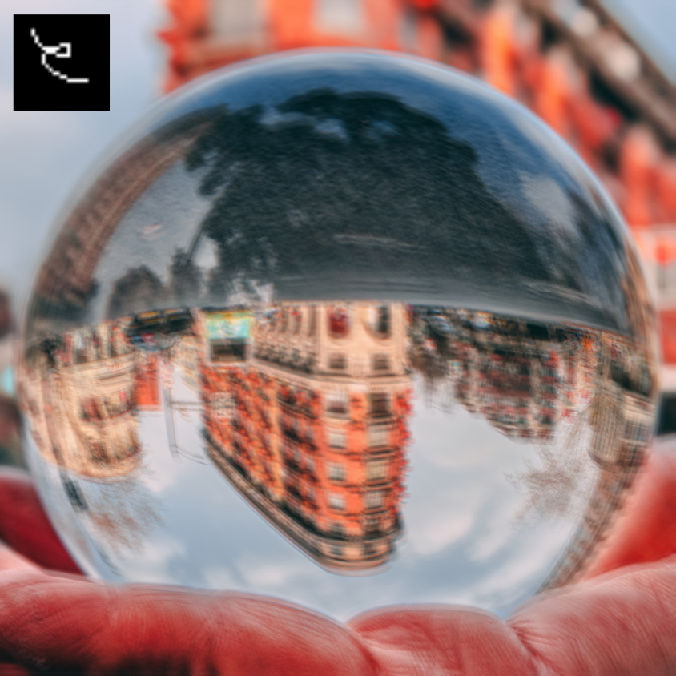
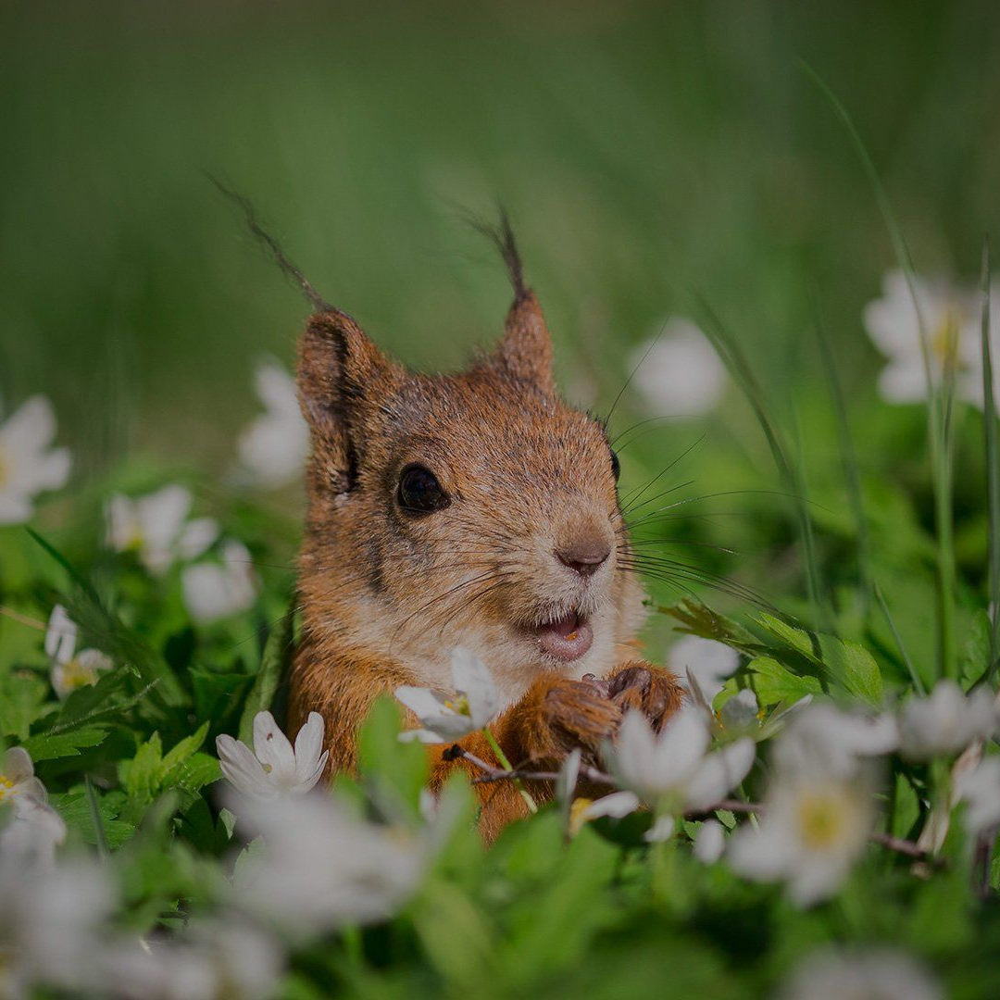

# Implementation of `High-Quality Motion Deblurring from a Single Image (SIGGRAPH 2008)`

This repository refers to a project for the course INF01046 - Image Processing Fundamentals at [INF](https://www.inf.ufrgs.br/site/en) in [UFRGS](http://www.ufrgs.br/ufrgs/inicial).

This is link to the [Original Paper](http://www.cse.cuhk.edu.hk/%7Eleojia/projects/motion_deblurring/index.html)

## Brief Documentation

- **blind/** - contains some images generated from our blind deconvolution
- **non-blind/** - contains some images generated from our non-blind deconvolution
- **examples/** - contains a few examples of blurred images and their respective blurred kernels
- **fails/** - contains some fails generated during work
- **convolve.py** - contains the methods related to convolution
- **deblur.py** - contains the methods to perform the deconvolution
- **helpers.py** - contains some methods for reading images and kernels
- **main.py** - performs the algorithm

For a more detailed and comprehensive explanation of this project, please refer to this [document](report.pdf).

## Results

### Non-Blind Deconvolution
These are the results of applying non-blind deconvolution (the input is both the blurred image and the kernel) to certain images:

<table>
  <tr>
    <td><strong>Original Image</strong></td>
    <td><strong>Blurred Image and Kernel</strong></td>
    <td><strong>Our Results</strong></td>
  </tr>
  <tr>
    <td></td>
    <td></td>
    <td></td>
  </tr>
  <tr>
    <td></td>
    <td></td>
    <td></td>
  </tr>
    <tr>
    <td></td>
    <td></td>
    <td></td>
  </tr>
</table>

### Blind Deconvolution
These are the results of applying blind deconvolution (the input is only the blurred image) comparing the results with the original paper:

<table>
  <tr>
    <td><strong>Blurred Image</strong></td>
    <td><strong>Our Results</strong></td>
    <td><strong>Original Paper</strong></td>
  </tr>
  <tr>
    <td></td>
    <td></td>
    <td></td>
  </tr>
  <tr>
    <td></td>
    <td></td>
    <td></td>
  </tr>
  <tr>
    <td></td>
    <td></td>
    <td></td>
  </tr>
  <tr>
    <td></td>
    <td></td>
    <td></td>
  </tr>
</table>
